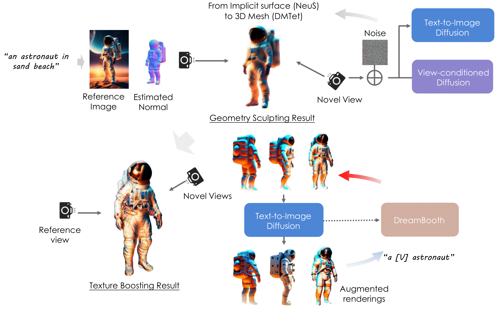
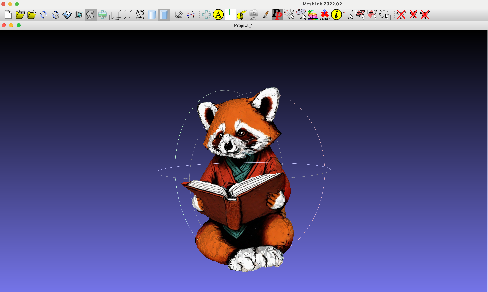

# DreamCraft3D

[**Paper**](https://arxiv.org/abs/2310.16818) | [**Project Page**](https://mrtornado24.github.io/DreamCraft3D/) | [**Youtube video**](https://www.youtube.com/watch?v=0FazXENkQms) | [**Replicate demo**](https://replicate.com/jd7h/dreamcraft3d)

Official implementation of DreamCraft3D: Hierarchical 3D Generation with Bootstrapped Diffusion Prior

[Jingxiang Sun](https://mrtornado24.github.io/), [Bo Zhang](https://bo-zhang.me/), [Ruizhi Shao](https://dsaurus.github.io/saurus/), [Lizhen Wang](https://lizhenwangt.github.io/), [Wen Liu](https://github.com/StevenLiuWen), [Zhenda Xie](https://zdaxie.github.io/), [Yebin Liu](https://liuyebin.com/)


Abstract: *We present DreamCraft3D, a hierarchical 3D content generation method that produces high-fidelity and coherent 3D objects. We tackle the problem by leveraging a 2D reference image to guide the stages of geometry sculpting and texture boosting. A central focus of this work is to address the consistency issue that existing
works encounter. To sculpt geometries that render coherently, we perform score
distillation sampling via a view-dependent diffusion model. This 3D prior, alongside several training strategies, prioritizes the geometry consistency but compromises the texture fidelity. We further propose **Bootstrapped Score Distillation** to
specifically boost the texture. We train a personalized diffusion model, Dreambooth, on the augmented renderings of the scene, imbuing it with 3D knowledge
of the scene being optimized. The score distillation from this 3D-aware diffusion prior provides view-consistent guidance for the scene. Notably, through an
alternating optimization of the diffusion prior and 3D scene representation, we
achieve mutually reinforcing improvements: the optimized 3D scene aids in training the scene-specific diffusion model, which offers increasingly view-consistent
guidance for 3D optimization. The optimization is thus bootstrapped and leads
to substantial texture boosting. With tailored 3D priors throughout the hierarchical generation, DreamCraft3D generates coherent 3D objects with photorealistic
renderings, advancing the state-of-the-art in 3D content generation.*

<p align="center">
    
</p>


## Method Overview
<p align="center">
    
</p>


<!-- https://github.com/MrTornado24/DreamCraft3D/assets/45503891/8e70610c-d812-4544-86bf-7f8764e41067


https://github.com/MrTornado24/DreamCraft3D/assets/45503891/b1e8ae54-1afd-4e0f-88f7-9bd5b70fd44d


https://github.com/MrTornado24/DreamCraft3D/assets/45503891/ead40f9b-d7ee-4ee8-8d98-dbd0b8fbab97 -->

## Installation
### Install threestudio

**This part is the same as original threestudio. Skip it if you already have installed the environment.**

See [installation.md](docs/installation.md) for additional information, including installation via Docker.

- You must have an NVIDIA graphics card with at least 20GB VRAM and have [CUDA](https://developer.nvidia.com/cuda-downloads) installed.
- Install `Python >= 3.8`.
- (Optional, Recommended) Create a virtual environment:

```sh
python3 -m virtualenv venv
. venv/bin/activate

# Newer pip versions, e.g. pip-23.x, can be much faster than old versions, e.g. pip-20.x.
# For instance, it caches the wheels of git packages to avoid unnecessarily rebuilding them later.
python3 -m pip install --upgrade pip
```

- Install `PyTorch >= 1.12`. We have tested on `torch1.12.1+cu113` and `torch2.0.0+cu118`, but other versions should also work fine.

```sh
# torch1.12.1+cu113
pip install torch==1.12.1+cu113 torchvision==0.13.1+cu113 --extra-index-url https://download.pytorch.org/whl/cu113
# or torch2.0.0+cu118
pip install torch torchvision --index-url https://download.pytorch.org/whl/cu118
```

- (Optional, Recommended) Install ninja to speed up the compilation of CUDA extensions:

```sh
pip install ninja
```

- Install dependencies:

```sh
pip install -r requirements.txt
```

### Download pre-trained models
- **Zero123**. We use the newest `stable-zero123.ckpt` by default. You can download it [here](https://huggingface.co/stabilityai/stable-zero123) into `load/zero123/`. In the paper we use `zero123-xl.ckpt` and you can download it by
```sh
cd load/zero123
bash download.sh
```

- **Omnidata**. We use [Omnidata](https://github.com/EPFL-VILAB/omnidata/tree/main/omnidata_tools/torch) for depth and normal predition in `preprocess_image.py` (copyed from [stable-dreamfusion](https://github.com/ashawkey/stable-dreamfusion)).
```sh
cd load/omnidata
gdown '1Jrh-bRnJEjyMCS7f-WsaFlccfPjJPPHI&confirm=t' # omnidata_dpt_depth_v2.ckpt
gdown '1wNxVO4vVbDEMEpnAi_jwQObf2MFodcBR&confirm=t' # omnidata_dpt_normal_v2.ckpt
```

## Quickstart
Preprocess the input image to move background and obtain its depth and normal image.
```sh
python preprocess_image.py /path/to/image.png --recenter
```
Our model is trained in multiple stages. You can run it by
```sh
prompt="a brightly colored mushroom growing on a log"
image_path="load/images/mushroom_log_rgba.png"

# --------- Stage 1 (NeRF & NeuS) --------- # 
python launch.py --config configs/dreamcraft3d-coarse-nerf.yaml --train system.prompt_processor.prompt="$prompt" data.image_path="$image_path"

ckpt=outputs/dreamcraft3d-coarse-nerf/$prompt@LAST/ckpts/last.ckpt
python launch.py --config configs/dreamcraft3d-coarse-neus.yaml --train system.prompt_processor.prompt="$prompt" data.image_path="$image_path" system.weights="$ckpt"

# --------- Stage 2 (Geometry Refinement) --------- # 
ckpt=outputs/dreamcraft3d-coarse-neus/$prompt@LAST/ckpts/last.ckpt
python launch.py --config configs/dreamcraft3d-geometry.yaml --train system.prompt_processor.prompt="$prompt" data.image_path="$image_path" system.geometry_convert_from="$ckpt"


# --------- Stage 3 (Texture Refinement) --------- # 
ckpt=outputs/dreamcraft3d-geometry/$prompt@LAST/ckpts/last.ckpt
python launch.py --config configs/dreamcraft3d-texture.yaml --train system.prompt_processor.prompt="$prompt" data.image_path="$image_path" system.geometry_convert_from="$ckpt"
```

<details>
<summary>[Optional] If the "Janus problem" arises in Stage 1, consider training a custom Text2Image model.</summary>

First, generate multi-view images from a single reference image by Zero123++.

```sh
python threestudio/scripts/img_to_mv.py --image_path 'load/mushroom.png' --save_path '.cache/temp' --prompt 'a photo of mushroom' --superres
```
Train a personalized DeepFloyd model by DreamBooth Lora. Please check if the generated mv images above are reasonable.

```sh
export MODEL_NAME="DeepFloyd/IF-I-XL-v1.0"
export INSTANCE_DIR=".cache/temp"
export OUTPUT_DIR=".cache/if_dreambooth_mushroom"

accelerate launch threestudio/scripts/train_dreambooth_lora.py \
  --pretrained_model_name_or_path=$MODEL_NAME  \
  --instance_data_dir=$INSTANCE_DIR \
  --output_dir=$OUTPUT_DIR \
  --instance_prompt="a sks mushroom" \
  --resolution=64 \
  --train_batch_size=4 \
  --gradient_accumulation_steps=1 \
  --learning_rate=5e-6 \
  --scale_lr \
  --max_train_steps=1200 \
  --checkpointing_steps=600 \
  --pre_compute_text_embeddings \
  --tokenizer_max_length=77 \
  --text_encoder_use_attention_mask
```

The personalized DeepFloyd model lora is save at `.cache/if_dreambooth_mushroom`. Now you can replace the guidance the training scripts by

```sh
# --------- Stage 1 (NeRF & NeuS) --------- # 
python launch.py --config configs/dreamcraft3d-coarse-nerf.yaml --train system.prompt_processor.prompt="$prompt" data.image_path="$image_path" system.guidance.lora_weights_path=".cache/if_dreambooth_mushroom"
```
</details>

## Tips
- **Memory Usage**. We run the default configs on 40G A100 GPUs. For reducing memory usage, you can reduce the rendering resolution of NeuS by ```data.height=128 data.width=128 data.random_camera.height=128 data.random_camera.width=128```. You can also reduce resolution for other stages in the same way.

## Export Meshes
You can export the textured mesh obj using the following scipt:
```sh
# this uses default mesh-exporter configurations which exports obj+mtl
python launch.py --config path/to/trial/dir/configs/parsed.yaml --export --gpu 0 resume=path/to/trial/dir/ckpts/last.ckpt system.exporter_type=mesh-exporter
```
<details>
<summary>
Visualization of the example OBJ File.
</summary>
<p align="center">
    
</p>
</details>

## Todo

- [x] Release the reorganized code.
- [ ] Realse the test image data.
- [ ] Clean the original dreambooth training code.
- [ ] Provide some running results and checkpoints.

## Credits
This code is built on the amazing open-source projects [threestudio-project](https://github.com/threestudio-project/threestudio) and [stable-dreamfusion](https://github.com/ashawkey/stable-dreamfusion).

## Related links

- [DreamFusion](https://dreamfusion3d.github.io/)
- [Magic3D](https://research.nvidia.com/labs/dir/magic3d/)
- [Make-it-3D](https://make-it-3d.github.io/)
- [Magic123](https://guochengqian.github.io/project/magic123/)
- [ProlificDreamer](https://ml.cs.tsinghua.edu.cn/prolificdreamer/)
- [DreamBooth](https://dreambooth.github.io/)

## BibTeX

```bibtex
@article{sun2023dreamcraft3d,
  title={Dreamcraft3d: Hierarchical 3d generation with bootstrapped diffusion prior},
  author={Sun, Jingxiang and Zhang, Bo and Shao, Ruizhi and Wang, Lizhen and Liu, Wen and Xie, Zhenda and Liu, Yebin},
  journal={arXiv preprint arXiv:2310.16818},
  year={2023}
}
```
